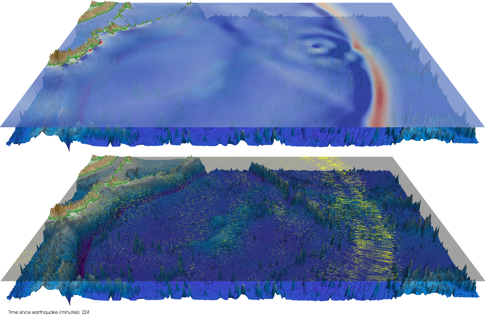

SWE
===

[An Education-Oriented Code for Parallel Tsunami Simulation.](Documentation/Mainpage.md)

## General Information
This code has been tested under Ubuntu 20.04 or higher. Other Linux distributions will probably work. However, we do not recommend using Windows or MacOS. If you do not have Linux installed on your computer, please use WSL, Virtual Machine, or similar.
Since SWE uses CMake, it should work under Windows with MSVC or MacOS.

## Dockerfile
You can use the Dockerfile included in the repository. This will create an image where everything is set up and you can just begin with compiling the code.

Of course, you can also just look at the Dockerfile as a recipe on how to set up your environment.

For a short introduction on how to generate, build and run a Docker container, refer to [Dockerfile](/Tools/README.md).

## Tutorial
### Compilation
As build system configurator we use CMake. To compile the code execute the following commands in this directory:

* Create a build directory: `mkdir build`. You can also choose any other name for your build directory.
* Switch to this directory: `cd build`
* (Optional): Choose the compiler being used (if you want to use a specific MPI compiler/version): `export CXX=mpic++`
* Run CMake: `cmake ..` (this configures a `RelWithDebInfo` build, which is default. For a `Debug` build, run `cmake .. -DCMAKE_BUILD_TYPE=Debug`) and for a `Release` build, `cmake .. -DCMAKE_BUILD_TYPE=Release`. This is especially recommended in production and benchmark runs.
* For developing, consider `cmake .. -DENABLE_DEVELOPER_MODE=ON`. For an overview of all availble options, use `ccmake ..`
* Run Make: `make` (or `make -j` for compiling with multiple cores)
* Run `make help` to see all available targets to build.

### Running a Simulation
* Run the code in serial via `./SWE-Serial-Runner`
* With `./SWE-Serial-Runner --help`, you can see additional command-line arguments you can pass.
* Run the code in parallel via `mpirun -np nproc ./SWE-MPI-Runner`
* With `./SWE-MPI-Runner --help`, you can see additional command-line arguments you can pass.

### Adding new source files
You can add new source files by just creating them somewhere within the `Source` folder. CMake automatically detects these files and adds them to the build.

### Testing
Some basic unit tests have been implemented (`make test`). Feel free to add your own test cases inside the `Tests` folder.

### Visualization with ParaView
The command line version of SWE will write a NetCDF file or multiple ASCII-VTK files (depending on the build configuration) which can be opened and visualized with ParaView.

**Hint:** The output files contain the absolute height of the water column _h_. To get the relative height of the water column, use a _Calculator_ in Paraview with the formula `h+b`. If you have dry cells in your scenario, you may want to use the formula `min(h, h+b)`. This will give you the relative height for wet cells and 0 for dry cells.

Besides the [VTKWriter](/Source/Writers/VTKWriter.hpp), SWE is also able to write [netCDF](http://www.unidata.ucar.edu/software/netcdf/) files. You can enable the [NetCDFWriter](/Source/Writers/NetCDFWriter.hpp) with the CMake option `-DENABLE_NETCDF=ON`.

The [NetCDFWriter](Source/Writers/NetCDFWriter.hpp) has two advantages:
* It creates binary files and is therefore faster to read and write.
* All time steps are stored in a single file.

The [NetCDFWriter](Source/Writers/NetCDFWriter.hpp) respects the COARDS standard, thus you can also visualize the netCDF files with ParaView.

### Visualization with SWE-Visualizer
[Under development](https://github.com/TUM-I5/SWE-Visualizer)

### Creating a Doxygen documentation
* Run the following CMake command: `cmake .. -DENABLE_DEVELOPER_MODE=ON -DOPT_ENABLE_DOXYGEN=ON`
* `make doxygen-docs`
* You should now see in your build directory a folder called `html`
* Open `index.html` to see the generated documentation.

## Development Hints & FAQ
### It does not compile and everything seems fine?
Make sure to use `make clean` before you use `make`. Sometimes there are build artifacts from previous build processes that spoil your current compilation process. `make clean` takes care of deleting everything that should not be there and allows the compiler to start from scratch.

Sometimes it is also helpful to delete the `build` folder and create a new one, following the steps from the compilation section above.

### How can I see all the compiler flags the generated Makefile is using?
Instead of using `make`, run `VERBOSE=1 make`. You can also run `make -n` to invoke a dry run where you see what the Makefile would do in case of compilation.

### How can I see the test output?
Instead of using `make test`, run `ctest --verbose`.

## Course Material on SWE:
* [SWE - Anatomy of a Parallel Shallow Water Code](http://www5.in.tum.de/SWE/lugano2013/swe_anatomy.pdf) (introduction given at the [CSCS-USI Summer School on Computer Simulations in Science and Engineering](http://icsweb.inf.unisi.ch/cms/index.php/component/content/article/12-news/95-summerschool2013.html)  in Lugano , July 8-19, 2013)
* [SWE – An Education-Oriented Code to Solve the Shallow Water Equations](http://www.mac.tum.de/g2s3/swe_g2s3_2012.pdf) (presentation given at the [Gene Golub SIAM Summer School 2012](http://www.mac.tum.de/g2s3/) on "Simulation and Supercomputing in the Geosciences", Monterey, July 29 - August 10, 2012)